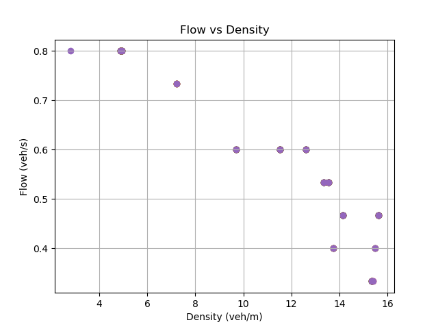
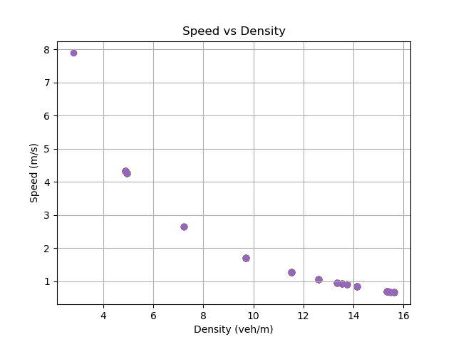

# ITSC 2024 Reproducibility in Transportation Research: A Hands-on Tutorial

>📋  A template README.md for code accompanying a Machine Learning paper

# Car Following

>📋  Optional: include a graphic explaining your approach/main result, bibtex entry, link to demos, blog posts and tutorials

## Requirements

To install requirements:

```setup
pip install -r requirements.txt
```

>📋  Describe how to set up the environment, e.g. pip/conda/docker commands, download datasets, etc...

## Results
To get results, run
```python simulator.py --run-idm --no-render```

Plots will be generated in the project folder.

Here are the results of my simulation:
 

## Contributing

>📋  Pick a licence and describe how to contribute to your code repository. 

## Acknolwedgements

Readme template: https://github.com/paperswithcode/releasing-research-code

